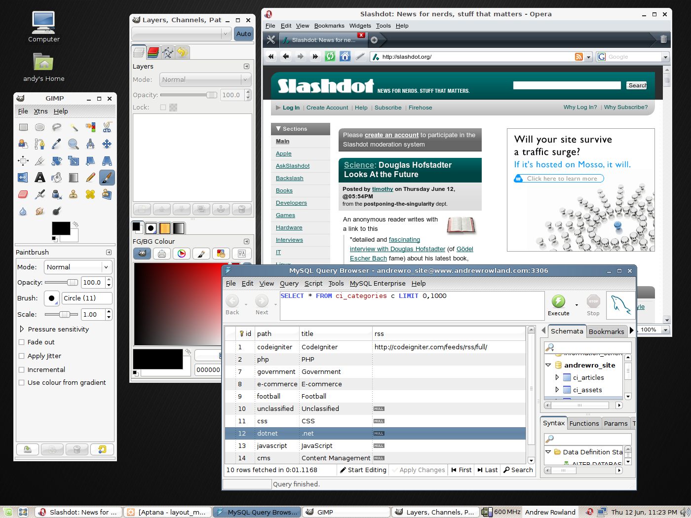
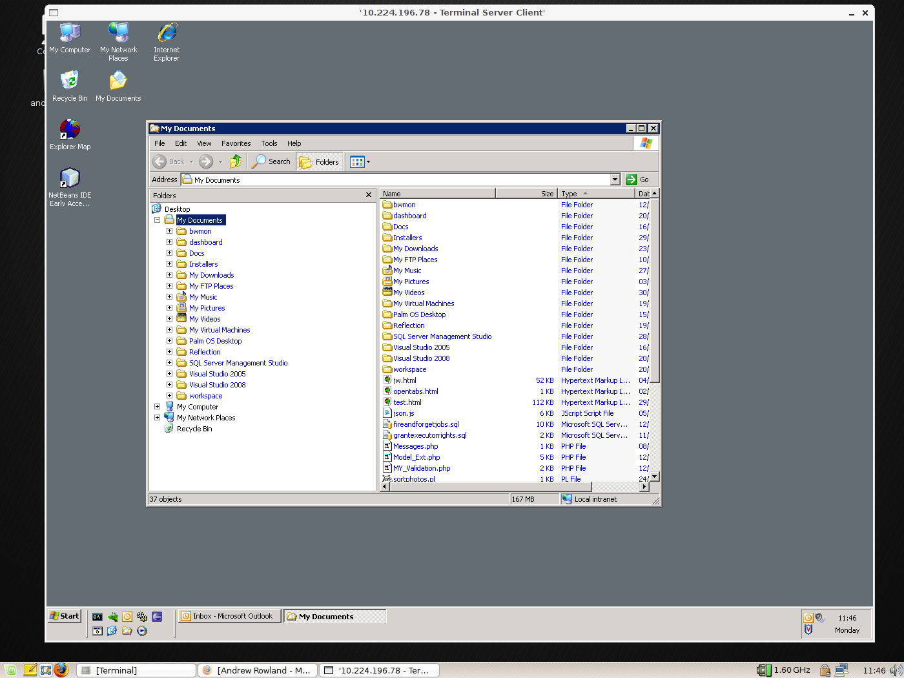
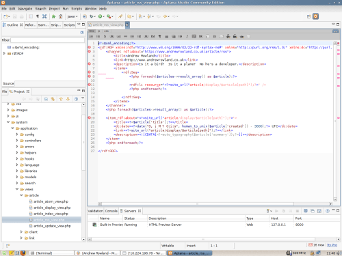
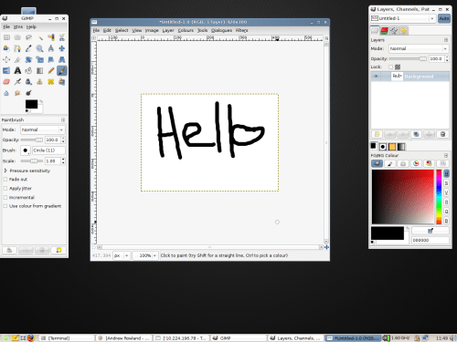
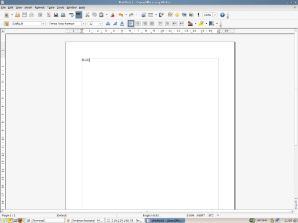

I've been using Ubuntu for the past couple of years now, and have found it a perfectly viable alternative to Windows. As I mentioned in my very first post, I'm not a Linux zealot taking a political stance. It's just a simple preference. If I was a zealot I'd be using a distribution like Gentoo, Slackware, or Linux From Scatch. One for the hard nuts, I just want something that works on my five year old laptop. I'm too tight to upgrade, so that rules out Vista. Now there's an OS that drives Linux fundamentalism.

In an attempt to challenge my OS of choice, but still keeping within my Ubuntu comfort zone, I installed [Linux Mint](https://linuxmint.com/) last week. Once slated as just a friendly, sexier version of [Ubuntu](https://ubuntu.com/), it now seems to be gaining in popularity.

I'm very impressed. I installed the OS, development IDE (Eclipse based Aptana), Apache, PHP, MySQL, and had the development version of this site up and running within a couple of hours. No messing around getting Flash, RealPlayer, and various audio/video codecs running. Anything I did need to install was a simple apt-get away in the Ubuntu repositories.

