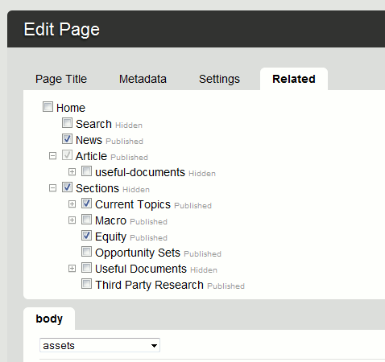

For many small projects I've been using Wolf CMS, a really nice and fairly lightweight application for managing content. What I like about it is that the core code is quite minimal, but allows you to extend using plugins.

Recently I've been asked to build a site that requires a the ability to relate other pages to the one an editor is currently editing.

The plugin can be [downloaded here](/downloads/related_pages.zip). Note: This version is for Wolf 0.7.2 and above. The older plugin for Wolf 0.6 is [also available](/downloads/related_pages_0_0_2.zip). Once installed in the plugins directory and enabled in the administration screen, the following tab is now available when editing pages: Once installed in the plugins directory and enabled in the admininistration screen, the following tab is now available when editing pages:

See the documention screen for sample frontend code which lists the related pages.

Please be aware that I really did knock this together rather quickly, but it works for me. If anyone finds any bugs, please let me know.

## 6 thoughts on “Wolf CMS Related Pages plugin”

### Steven
*January 15, 2011 at 4:08 pm*

Very nice work! The plugin for Wolf version 0.6 works perfectly but I also tried the version for wolf 0.7.2 and it didn’t open the sub pages.

I tried it on a fresh install of the latest Wolf release (which is 0.7.3) so maybe that why the sub pages didn’t show. Just letting you know in case the problem is coming from version 0.7.3

Still amazing! Keep up the good work!

---

### Steven
*March 19, 2011 at 1:54 pm*

Hey Andrew, I found a bug in your plugin,
in the DeleteAllByPage function, you need to change it to

    Record::deleteWhere(__CLASS__, ‘page_id = ? OR related_page_id’, array($page_id, $page_id));

Because you also need to delete all of the records of the pages linked to the deleted page. When you get the relations, you get the url manually… but if you give it an id of a page that was deleted, it loops forever. So when a page is deleted, make sure you delete it’s entries and the entries of the pages linking to it.

---

### Steven
*March 19, 2011 at 1:55 pm*

Sorry, there was a mistake in the line I sent you… this is the fix:

    Record::deleteWhere(__CLASS__, ‘page_id = ? OR related_page_id = ?’, array($page_id, $page_id));

---

### Andy
*March 19, 2011 at 6:18 pm*

Thanks Steven, the download now includes your fix. Thanks for this, it’s much appreciated.

---

### Christoph
*October 10, 2011 at 6:22 am*

Hi!

super plugin for wolf cms! My question: are there any possibilities to show the “parent->title()” of a “related article”??

Thank you for your help!

Greetings from Germany!
Christoph

---

### Andy R
*October 10, 2011 at 8:57 pm*

You should by able to access the parent like you would any page object:

    <?php
    $relations = get_relations($this->id);

    if (!empty($relations)){
      echo '<ul>';
      foreach ($relations as $related){
        echo '<li>' . $related->parent()->title() . ': ' . $related->link() . '</li>';
      }
      echo '</ul>';
    }
    ?>

But I still think there is a problem with incorrectly initialised objects when obtained by the findById function.

See: https://github.com/wolfcms/wolfcms/issues/175

---